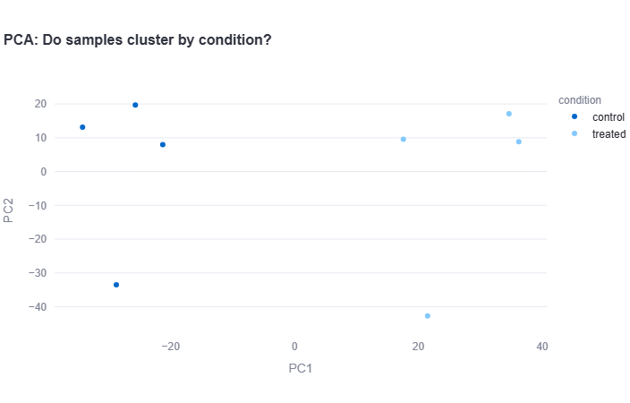
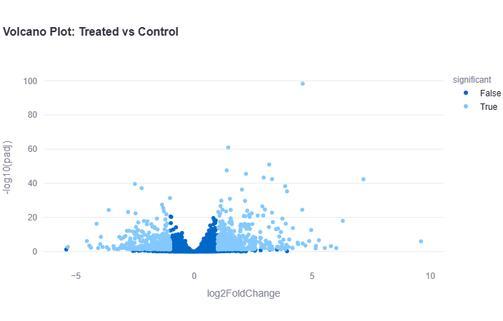
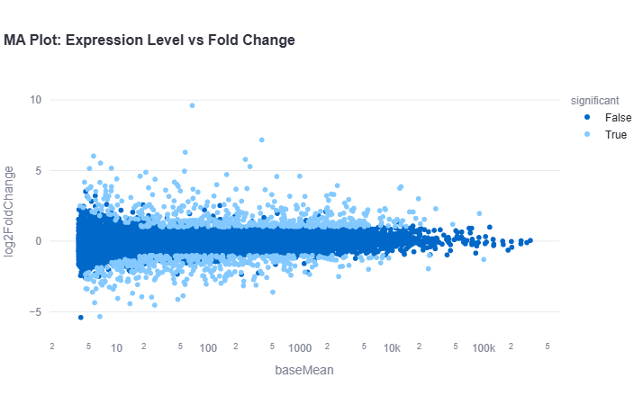

# RNA-Seq Analyzer

An interactive web app for analyzing RNA-Seq gene expression data — upload a counts matrix, run differential expression analysis, and explore results through interactive visualizations.

Built while learning bioinformatics data analysis, using the real published **airway dataset** (Himes et al. 2014) — human airway smooth muscle cells treated with dexamethasone (an asthma medication) vs. untreated controls.

## What it does

1. **Upload** a gene counts matrix (CSV) and sample metadata (CSV)
2. **Validate** that sample names match between both files
3. **Normalize** raw counts using CPM (Counts Per Million)
4. **Differential expression analysis** using DESeq2 (via PyDESeq2) — identifies which genes are significantly different between conditions
5. **Visualize** results:
   - PCA plot — do samples cluster by condition?
   - Volcano plot — fold change vs. statistical significance
   - MA plot — expression level vs. fold change

## Tech stack

- Python
- Streamlit (web app framework)
- Pandas (data handling)
- PyDESeq2 (differential expression statistics)
- Plotly (interactive visualizations)
- scikit-learn (PCA)

## How to run it locally

```bash
# Clone the repository
git clone https://github.com/Sarita0005/rna-seq-analyzer.git
cd rna-seq-analyzer

# Create and activate a virtual environment
python -m venv venv
venv\Scripts\activate   # Windows

# Install dependencies
pip install streamlit pandas numpy plotly pydeseq2 scikit-learn

# Run the app
streamlit run app.py
```

Then upload `airway_counts.csv` and `airway_metadata.csv` (included in this repo) to try it with real data.
## Screenshots

### PCA Plot


### Volcano Plot


### MA Plot



## Key findings

Running this analysis on the airway dataset reproduces a real published result: **CRISPLD2** (ENSG00000152583) shows a strong, highly significant increase in expression in dexamethasone-treated samples (log2FoldChange ≈ 4.6, padj ≈ 4×10⁻⁹⁹) — matching the original Himes et al. 2014 study, which identified CRISPLD2 as a glucocorticoid-responsive gene.

The PCA plot shows clean separation between control and treated samples along the first principal component, indicating the treatment has a strong, consistent effect on overall gene expression.

## What I learned

- How raw sequencing counts need normalization (CPM) before comparison across samples, since sequencing depth varies between samples
- How DESeq2 tests each gene for significant differential expression, and why adjusted p-value (padj) is used over raw p-value to control for false discoveries across thousands of genes tested simultaneously
- How to interpret PCA and volcano plots to assess data quality and identify significant genes
- Building a data pipeline: file upload → validation → normalization → statistical analysis → visualization